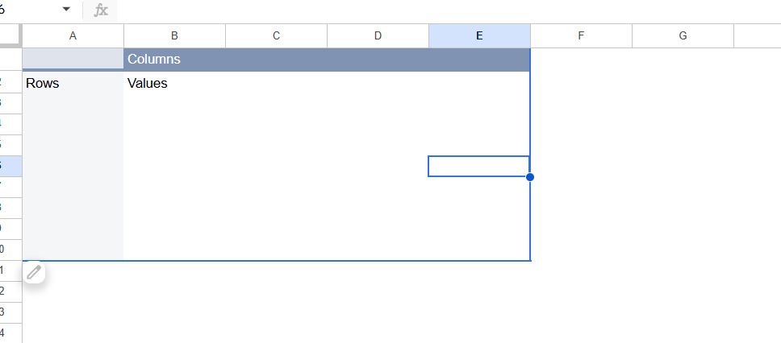

# Supply Chain Delivery Performance Analysis

## Overview
Analysis of 180,000+ supply chain orders to identify delivery performance issues and late delivery patterns.

## Tools Used
- SQL (DB Browser for SQLite)
- Power BI (Interactive Dashboard)

## Key Findings
- 54.83% of orders have late delivery risk
- First Class shipping has the worst late delivery rate at 95.32%
- Only 17.84% of orders shipped on time
- Standard Class is the most reliable shipping method at 38% late rate

## Business Insight
Despite being the premium option, First Class shipping performed worst for on-time delivery — suggesting a systemic fulfillment issue that would cost the business customer satisfaction and repeat orders.

## Dashboard Preview

## Files
- `supply_chain_analysis.sql` - SQL queries used for analysis
- `supply_chain_dashboard.pbix` - Power BI dashboard file
